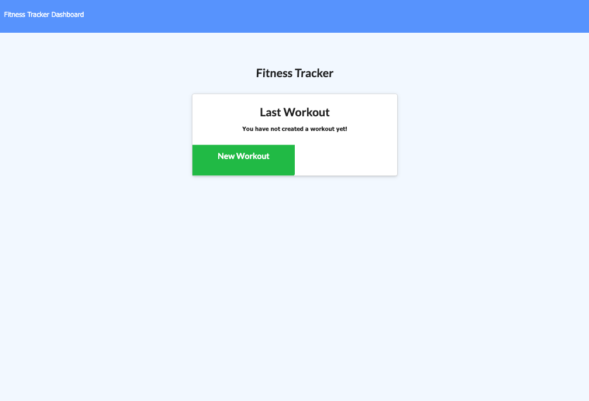

# fitness-tracker

## Description

A fitness tracker for following your workouts with handy built-in tables and data recollection. Deployed on heroku with MongoDB.

## Table of Contents

* [Installation](#installation)
* [Usage](#usage)
* [License](#license)
* [Contributing](#contributing)
* [Questions](#questions)


## Installation

- All the `code` required to get started

### Clone

- Clone this repo to your local machine using `https://github.com/a-mccaffrey/fitness-tracker.git`

### Setup


> install npm packages

```shell
$ npm install
```

### What it should look like



## Usage

Make sure you're connected to MongoDB on your machine if you want to use it locally. Simply enter "node server.js" in the terminal line (provided you are in the correct folder) and it will launch on your computer.

You can also visit the deployed application on Heroku at: 

https://hidden-sea-11352.herokuapp.com/


## License

This project is under the MIT license. For full license information, please [click here](https://choosealicense.com/licenses/MIT/). 


## Contributing

> To get started...

### Step 1

- **Option 1**
    - 🍴 Fork this repo!

- **Option 2**
    - 👯 Clone this repo to your local machine using `https://github.com/a-mccaffrey/fitness-tracker.git`

### Step 2

- **HACK AWAY!** 🔨🔨🔨

### Step 3

- 🔃 Create a new pull request using <a href="https://github.com/a-mccaffrey/fitness-tracker/compare/" target="_blank">`https://github.com/a-mccaffrey/fitness-tracker/compare/`</a>.


## Questions

Want to know more? Look me up on GitHub. My username is a-mccaffrey and my profile is [here](https://www.github.com/a-mccaffrey)

Alternatively, get in touch by emailing me at [aisling.s.mccaffrey@gmail.com](mailto:aisling.s.mccaffrey@gmail.com).